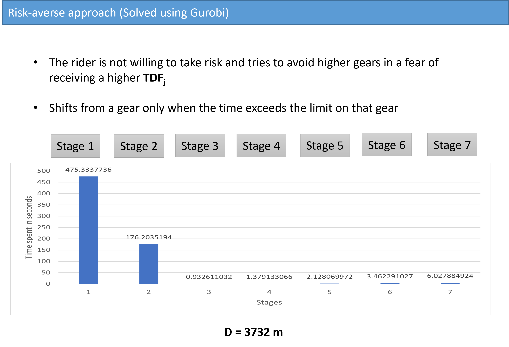
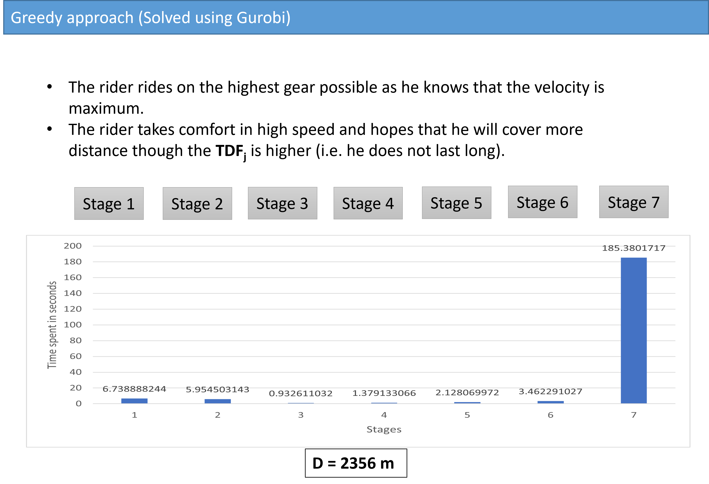
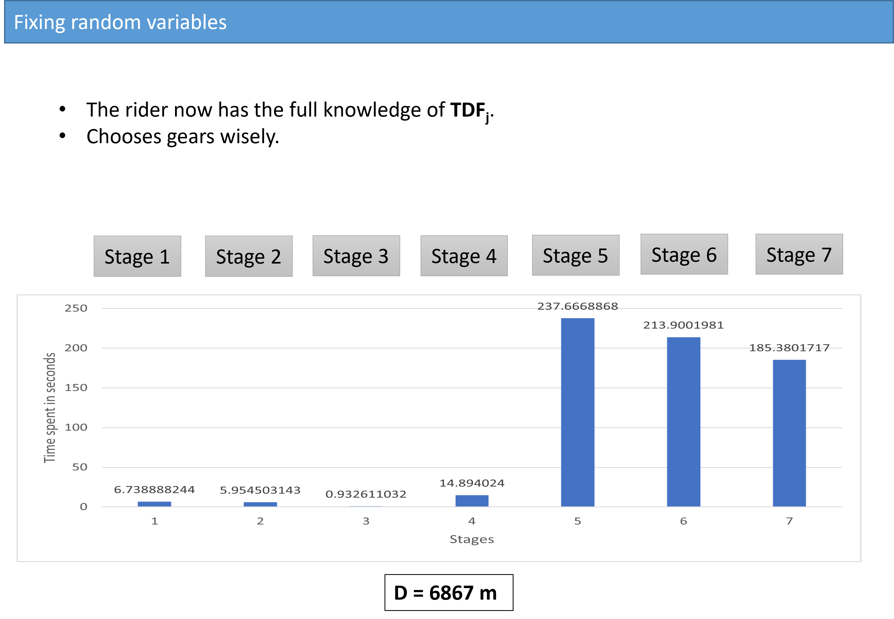
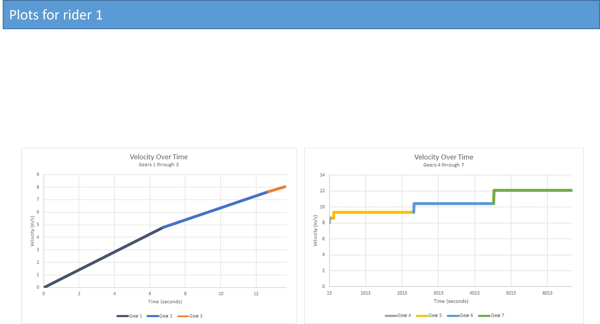
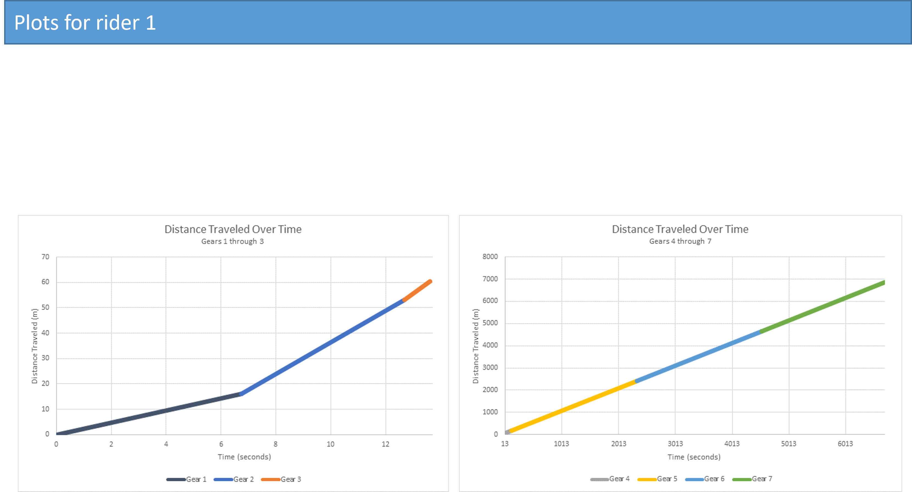

# Vehicle-Performance-Optimization
Designed a greedy algorithm based on Markov sequential decision-making process in MATLAB/Python to optimize using Gurobi solver, the wheel size, gear shifting sequence by modeling drivetrain constraints to achieve maximum laps in a race with a 2-hour time window.

